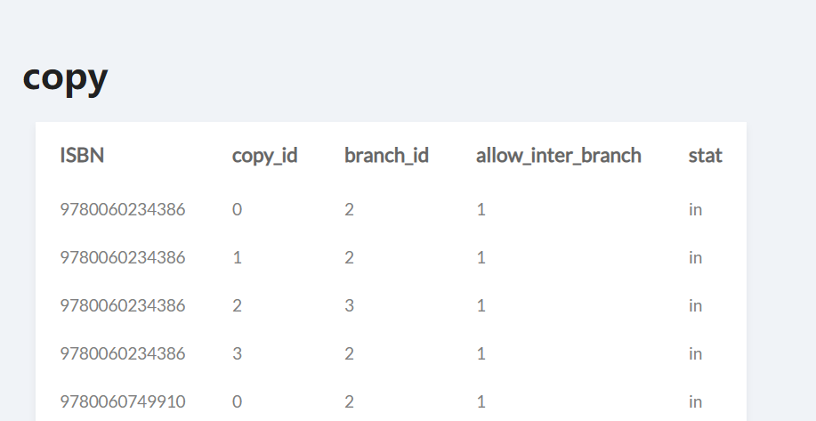
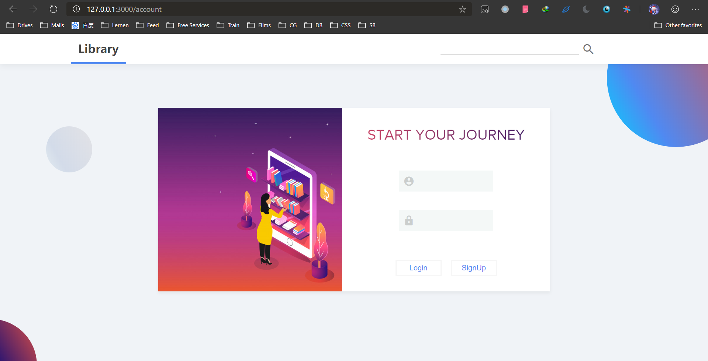
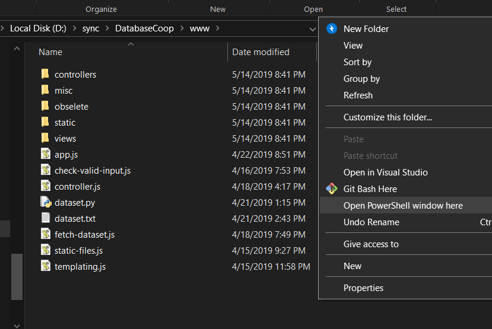
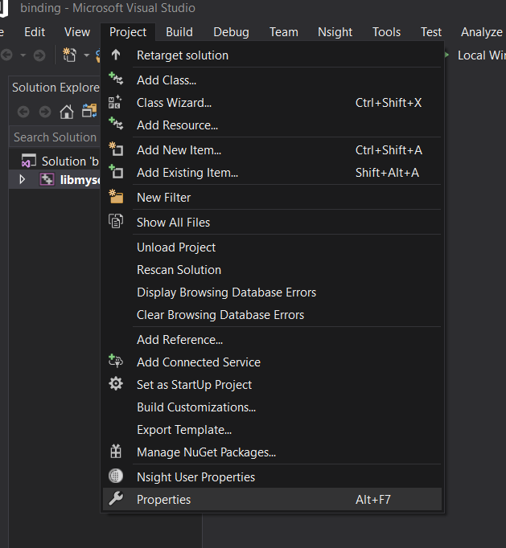
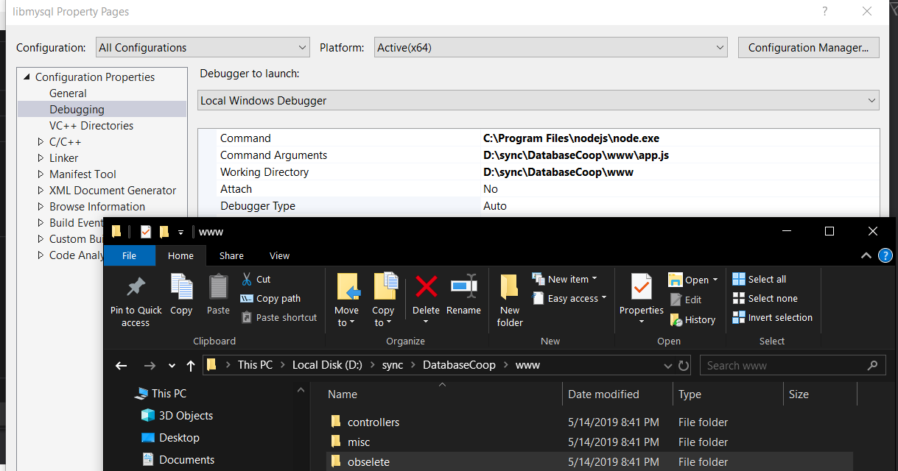
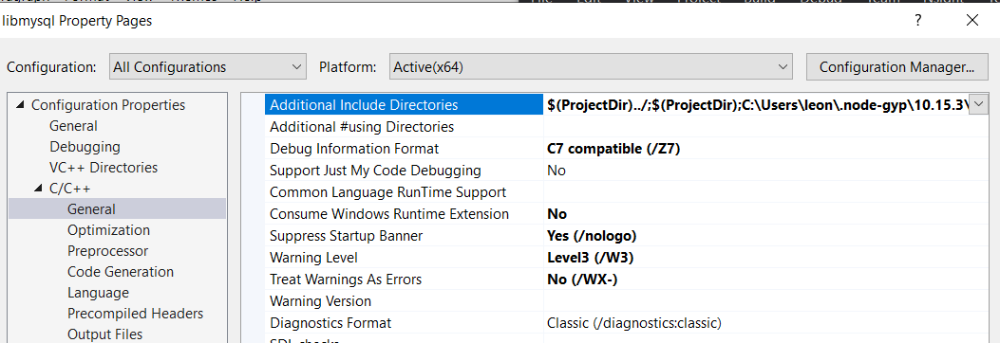
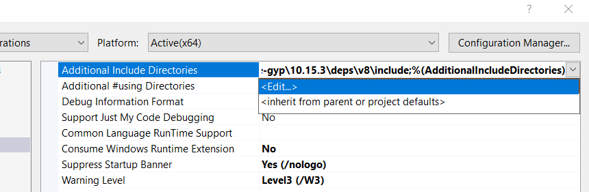
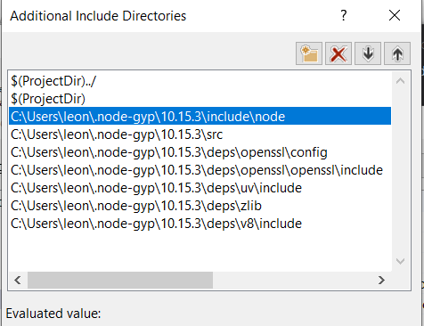
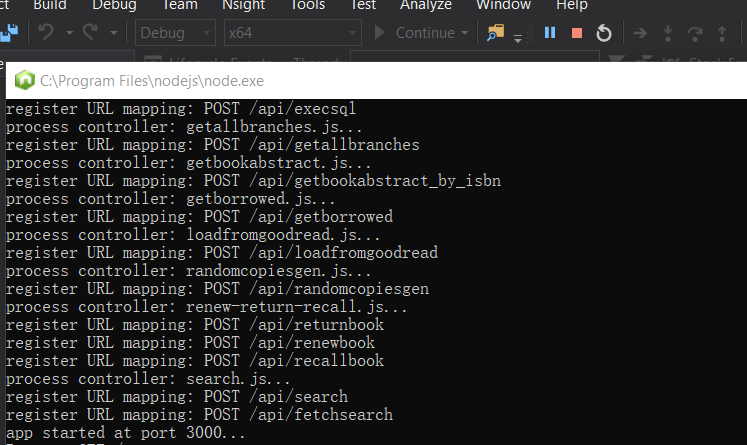

# DatabaseCoop

前端大致效果：

数据库界面



登录界面



### 环境配置

打开powershell:在资源管理器空余地方按住shift 加上鼠标右键



主要是前端的模块

- 需要安装[Nodejs](https://nodejs.org/en/). 

- 打开Powershell 输入命令(把数据源切换成国内的)

  ```bash
  npm config set registry https://registry.npm.taobao.org --global
  
  npm config set disturl https://npm.taobao.org/dist --global
  ```

  

- 安装`node-gyp`: 

  - 安装python2

  - 打开Powershell 输入以下命令

    注意把`/path/to/python2.7 ` 替换成python 安装目录，通常在`C:/Python27` 或者 `"C:/Program Files/Python27"` (注意路径名加引号)

    ```bash
    npm install -g node-gyp
    node-gyp --python /path/to/python2.7 
    ```

    

- 在`www`目录下打开Powershell 输入命令 (安装 `koa` 和相关中间件)

  ```bash
  npm install
  ```


### 编译项目

打开binding.sln, 打开项目设置




在Debugging 下修改三个加粗部分

- 第一行是node的安装地址，通常大家都一样，不用该
- 第二行是`app.js`的地址，在`./www`目录下，不过得改成绝对路径
- 第三行和第二行一样，除了少一个app.js

图中是我的电脑的绝对地址：




最后一个要改的地方是 C/C++ --> General --> Additional Include Dirs




选择Edit




你应该大致猜出要改什么了，把他们改成你们电脑下的对应目录，通常把`leon` 换成你们电脑用户名就好了。还有就是我们nodegyp 版本可能不同，所以`10.15.3` 版本号可能要改一下。




完成以后确认一下在Debug模式，以及x64，运行程序，如果成功你应该看到



浏览器打开`127.0.0.1:3000/account` 能看到登录界面

注册一个账户可以在

`127.0.0.1:3000/dashboard` 看到管理界面

### 关于源码

只要实现`Connection.h` 里的

```c++
std::shared_ptr<QueryResult> query(const char* txt);
```

和

```c++
Connection(const char *database, const char *user, const char*password) 
```

就可以了，然后我们就能用 javascript 访问我们的数据库了


还有就是我们内部在内存的数据可以用`sqldata.h` 表示。